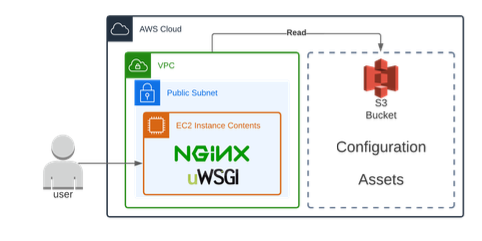

# Epitech AWS Workshop - Part 0

## Some links

 What | Link
------|-------
AWS | https://aws.amazon.com/
AWS Documentation | https://docs.aws.amazon.com/

## What is AWS ?

AWS stands for Amazon Web Services. It's a cloud computing platform that offers a lot of services. It's a way to host your applications and services.

## Why AWS ?

Because I know it better than other cloud providers and they offer a big free tier for students.

## Install and setup

### AWS CLI

First, you need to install the AWS CLI. It's a command line tool that allows you to interact with AWS services.

#### Linux

```bash
curl "https://awscli.amazonaws.com/awscli-exe-linux-x86_64.zip" -o "awscliv2.zip"
unzip awscliv2.zip
sudo ./aws/install

aws --version # Check if it's installed
```

#### MacOS

```bash
brew install awscli
# Or
curl "https://awscli.amazonaws.com/AWSCLIV2.pkg" -o "AWSCLIV2.pkg"
sudo installer -pkg AWSCLIV2.pkg -target /

aws --version # Check if it's installed
```

#### Create an AWS account

Go to https://aws.amazon.com/ and click on `Create an AWS Account`.

Choose `Personal` and fill the form.

#### Presentation of the project

This is a simple project.
An application using uWSGI framework and exposed with Nginx.
The configuration and the source code will be stored in a S3 bucket.
The application will be deployed on a EC2 instance.

