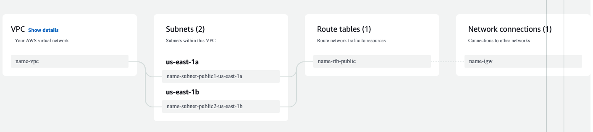

# Epitech AWS Workshop - Part 1

## Let's start at the beginning
### The VPC

A VPC is a virtual private cloud. It's a virtual network in the cloud. It allows you to create subnets, route tables, internet gateways, etc.

Here you will create a VPC with 2 subnets, a route table and an internet gateway.

#### Create the VPC

You want to select VPC and more to automatically create a VPC with subnets, route tables and internet gateways.

It should look like this:

### The S3 bucket

S3 is a storage service. It allows you to store files in buckets. You can configure the access to the bucket with IAM.

#### Create the S3 bucket

No need for a specific configuration, just create the bucket.

But do remember: The bucket name must be unique across all existing bucket names in Amazon S3.

#### Fill the bucket

You can now upload the configuration files and the source code of the application in the bucket.

Repo to get the project : https://github.com/Pepiloto/Workshop-AWS-Project

### The permissions

IAM is the service that allows you to manage permissions. You can create users, groups, roles, policies, etc.

#### Create a role

We want to create a role that will be used by the EC2 instance to access the S3 bucket.
Create a new role, select AWS Service and S3 as use case.

Search for the same checked permissions as in the screenshot below.

Name it and then create it.

### The EC2 instance

EC2 is the service that allows you to create virtual machines. You can choose the OS, the hardware, the storage, etc.

#### Create the Security group

A security group is a firewall. It allows you to configure the access to the instance.

We will add 3 rules to the security group:
- HTTP (TCP port 80) from anywhere
- HTTPS (TCP port 443) from anywhere
- SSH (TCP port 22) from your IP (or for everyone if you like to live dangerously)

#### Create the instance

Select Instance and then Launch instance.

Here you will have to choose the OS, the hardware, the storage, etc.

For the OS I'll take Amazon 2 AMI (HVM) because it's free tier eligible.

We will create a new key pair to connect to the instance with SSH.

In networking select Edit and then:
1) Select the VPC you created earlier
2) Select the public subnet
3) Enable auto-assign public IP
4) Select the security group you created earlier
5) Open Advanced Details
6) Select the IAM role you created earlier
7) Create the instance
8) Wait for the instance to be ready in the Dashboard
